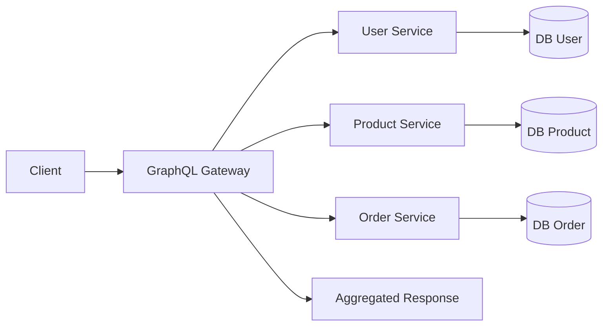

# UTS-stdt
## Nim :245410065
## Nama : Nur ridhwan 

# 1. Teorema CAP dan BASE

## CAP Theorem
Dalam sistem terdistribusi, hanya dua dari tiga properti berikut yang bisa dipenuhi secara bersamaan:

| Komponen | Penjelasan |
|---------|------------|
| **Consistency (C)** | Semua node memiliki data yang sama pada waktu yang sama. |
| **Availability (A)** | Sistem tetap memberi respons walau sebagian node gagal. |
| **Partition Tolerance (P)** | Sistem tetap berjalan meski ada gangguan jaringan antar node. |

Karena P wajib dalam sistem terdistribusi, pilihan realistis hanya:
- **CP** (Consistency + Partition Tolerance)
- **AP** (Availability + Partition Tolerance)

## BASE
BASE adalah filosofi sistem yang memilih **AP**:
- **Basically Available:** Sistem selalu memberi respons.
- **Soft-state:** Data bisa berubah sebelum akhirnya stabil.
- **Eventually Consistent:** Konsistensi dicapai secara bertahap.

## Keterkaitan
- **CAP** mendefinisikan batasan teoretis.
- **BASE** adalah prinsip desain untuk sistem yang memilih **AP**.
- Implementasi BASE adalah cara praktis untuk mengatasi batasan CAP.

## Contoh Singkat
Pada e-commerce:
- Server di berbagai lokasi bisa mengalami perbedaan data stok sesaat.
- Sistem tetap berjalan (A), meski data tidak segera konsisten.
- Konsistensi datang belakangan (eventual consistency / BASE).

---

# 2. GraphQL dan Komunikasi Antar Proses

GraphQL bekerja sebagai **API Gateway** atau **Data Orchestrator** dalam arsitektur microservices.  
Klien hanya mengirim satu query, lalu GraphQL berkomunikasi dengan berbagai service untuk mengumpulkan data.

## Peran GraphQL
- Mengurangi beban klien karena tidak perlu memanggil banyak endpoint.
- Mengatur komunikasi antar proses (internal microservices).
- Menggabungkan respons dari berbagai service menjadi satu hasil akhir.

## Diagram (Mermaid)
    

### No 3
Pada sistem terdistribusi, Teorema CAP menyatakan bahwa sebuah sistem hanya dapat memaksimalkan dua dari tiga aspek: Consistency, Availability, dan Partition Tolerance. Ketika jaringan mengalami gangguan atau pemisahan (partition), pengembang dipaksa memilih antara memastikan data selalu konsisten atau memastikan layanan tetap tersedia. Di sisi lain, pendekatan BASE menekankan bahwa tidak semua sistem harus sangat konsisten seperti model ACID. BASE menerima bahwa sistem dapat bersifat eventually consistent selama performa dan ketersediaannya tetap tinggi untuk kebutuhan skala besar.

Keduanya saling berkaitan karena BASE pada dasarnya merupakan filosofi desain yang lahir dari keterbatasan yang ditunjukkan oleh Teorema CAP. Ketika sebuah sistem memilih Availability dan Partition Tolerance, ia secara alami mendekati sifat BASE, yang lebih lentur terhadap inkonsistensi sementara. Ini membuat BASE menjadi strategi yang cocok untuk aplikasi berskala besar seperti media sosial, e-commerce, dan layanan global yang trafiknya tidak bisa diprediksi.

Dalam penerapannya, sistem yang mengutamakan konsistensi kuat biasanya lebih cocok untuk transaksi keuangan atau aplikasi kritikal yang tidak mentoleransi perbedaan data. Sebaliknya, sistem dengan filosofi BASE digunakan ketika kecepatan, skalabilitas, dan toleransi gangguan lebih penting daripada konsistensi langsung. Dengan memahami hubungan CAP dan BASE, pengembang bisa menentukan kompromi mana yang paling rasional untuk kebutuhan sistem yang sedang dibangun.
